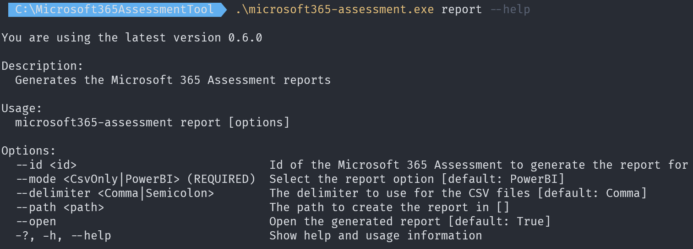

# Create assessment report

When an assessment run completes the typical next step is to produce a report or use the gathered data in some other form. These actions can be realized using the `report` option of the Microsoft 365 Assessment tool. For all adoption or deprecation scenarios implemented in the Microsoft 365 Assessment tool you can request a Power BI report that visualizes and summarizes the gathered data, enabling you to interpret the results and take the necessary actions. The generated Power BI report uses CSV files as data source and these files are created together with the report.

## Sample report commands

Before diving into all the possible command line arguments let's first show some typical use cases:

Task | CLI
-----|------
Generate Power BI report (includes CSV export) in the default location | microsoft365-assessment.exe report --id 22989c75-f08f-4af9-8857-6f19e333d6d3
Export the gathered data as CSV files in a custom location | microsoft365-assessment.exe report --id 22989c75-f08f-4af9-8857-6f19e333d6d3   --mode CsvOnly --path "c:\reports"

## Power BI

The report format used by the Microsoft 365 Assessment tool is Power BI and we've chosen this option for a number of reasons: after running an assessment and generating a report you often want to share it with other teams inside your organization. A Power BI report can be published to the Power BI service and then easily shared with and consumed by your other stakeholders. Also, sometimes the default generated reports might not fully satisfy your needs, using Power BI Desktop it is easy to update the generated report to fit your needs.

### Dependency on Power BI Desktop (Windows version)

After generating the Power BI report the Microsoft 365 Assessment tool will automatically open the report in Power BI Desktop. If you've not installed Power BI Desktop the report will still be generated, but opening it will fail. You can install Power BI Desktop from https://aka.ms/pbidesktopstore. After the report has opened in the Power BI Desktop the data will refresh, depending on the data size this can take a while to complete, so please allow Power BI Desktop enough time to complete the data refresh. When the data refresh is done you can start using the report, given the generated report is based upon a Power BI pbit file it means that you can save the report using the pbix format. Doing so will combine the data and the report into a single Power BI pbix file, which can then be easily copied and shared.

> [!Note]
> When you're using the macOS or Linux version there never will a Power BI report generated as there's no Power BI Desktop product for macOS and Linux. If you later on want to generate the Power BI report for an assessment ran on Linux of macOS, you then can copy the assessment output folder (guid = assessment id, located in the folder containing the Microsoft 365 Assessment tool) to the folder on a Windows machine where you've put the Windows version of the Microsoft 365 Assessment tool. When you then use `microsoft365-assessment.exe report --id <assessment id>` the report will be generated and opened in Power BI Desktop.

## Command line arguments

The easiest way to see all possible command line arguments for a command (e.g. for `report`) is using the `--help` parameter.

## Mandatory arguments

The key argument to specify is the `--id` argument as that will allow you to select the assessment for which a report must be generated. It's the easiest to copy the needed assessment id by using the `list` option as described in the [assessment operations](assess-operations.md) documentation. The report mode argument (`--mode`) is also required but since it defaults to `PowerBI` you don't need to specify it to create a Power BI report. If you however only want to generate CSV files then you need to set `--mode` to `CsvOnly`.

## Report location via `--path`

By default the assessment Power BI report and CSV files are generated inside a subfolder named `Report` underneath the report containing your assessment data. So assuming the Microsoft 365 Assessment tool was added in folder `c:\Microsoft365AssessmentTool` and the assessment id is `22989c75-f08f-4af9-8857-6f19e333d6d3`, then the report will live in `c:\Microsoft365AssessmentTool\22989c75-f08f-4af9-8857-6f19e333d6d3\report`. If you prefer to put the created Power BI report and CSV files in another location then you can specify the custom location via the `--path` argument. A sample: `--path "c:\reports"`.

## Report delimiter setting via `--delimiter`

When exporting the CSV files, which are used as data source for the Power BI report, by default the comma (`,`) is used as delimiter. If you're planning to also consume the CSV files directly and you're living in a country that uses semicolon (`;`) as delimiter then you can override the default delimiter via the `--delimiter` argument. A sample: `--delimiter Semicolon`.

## Controlling the Power BI report opening via `--open`

By default the generated Power BI report will open in Power BI Desktop. If you prefer to not open the report you can specify that via the `--open` argument. A sample: `--open:$false`.
